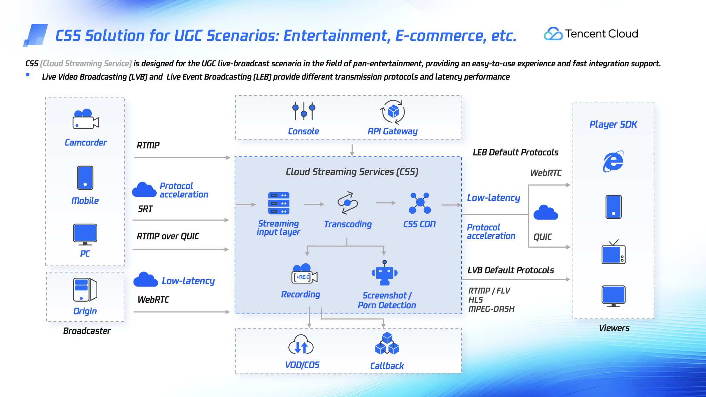
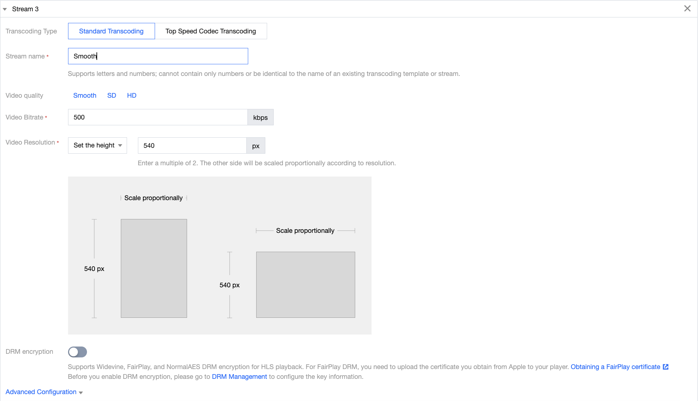

# workshop-css
Workshop for Tencent Cloud Cloud Streaming Service

CSS is a fully managed service to provide reliable, high-quality, low-latency live streaming easily and conveniently. CSS helps you configure your live streaming lifecycle quickly and easily by constructing templates that allow you to quickly and easily create and delete live channels.
After configuring your CSS channel using a template and getting your live feed into the cloud, you can get the playback URL. In other words, CSS manages transcoding and packaging and reliably provides streaming video to viewers through CSS CDN.

In this lab, we will cover how to use Cloud Streaming Service to acquire live feeds to the cloud and configure an end-to-end pipeline that can be played in the player.

# 1. Pre-requisites
Tencent Cloud Cloud Streaming Service is provided through the customer's domain. In other words, in order to use Tencent Cloud Cloud Streaming Service, it is necessary to notify and register ownership as the domain owner during the Push and Play Domain registration process. Once registered, you don't need to verify it again if you add a domain with the same parent domain.

# 2. Create a push domain
1. Click the *Domain* tab on the left tab of the CSS console main screen. Then you can check the currently configured CSS domains.
2. Click the *Add Domain* button located at the top of the main menu.

3. When the Add Domain pop-up appears, enter the value for Push Domain as shown below. Once the input is complete, click the *Add Domain* button to move to the next step.
Type : Push domain
Domain Name : Domain name to use for push

4. Refer to the CNAME Configuration menu and add the CNAME value for host in the DNS service.
*CNAME Configuration 메뉴*

*Add CNAME record to DNS*

*CNAME record verification*

# 3. Create a play domain

1. Click the *Domain* tab on the left tab of the CSS console main screen. Then you can check the currently configured CSS domains.

2. Click the *Add Domain* button located at the top of the main menu.

3. When the Add Domain pop-up appears, change the Type to Playback Domain and enter the values as shown below. Once the input is complete, click the *Add Domain* button to move to the next step.
Type : Play domain
Acceleralation region : Outside Chinese mainland 
Domain Name : playback 용으로 사용할 도메인 이름

4. Referring to the CNAME Configuration menu, add the CNAME value for host in the DNS service.
**CNAME Configuration menu**

**Add CNAME record to DNS**

**CNAME record verification**

# 4. Create a Adaptive Bitrate Domain

By using Tencent Cloud Cloud Streaming Service, you can configure an Adaptive Bitrate configuration with separately specified transcoding type, resolution, and bitrate as a template and use it in Cloud Streaming Service's HLS Stream and WebRTC Streaming.

> **NOTE**: When Tencent Cloud's Cloud Streaming Service uses a single bitrate format through HTTP-FLV or RTMP streaming in addition to HLS and WebRTC Streaming, detailed specifications of the stream must be configured by configuring the Live Transcoding function rather than Adaptive Bitrate. Supports configuration.

1. On the left tab of the CSS console main screen, click the *Feature Configuration -> Adaptive Bitrate* tab.
2. Click the *Create Template* button at the top of the Adaptive Bitrate console.
3. In CSS, you can configure the template to configure bitrate, resolution, etc. and create an ABR ladder.

    3-1. For Template Name, enter *testABR*. Any value can be entered.

    3-2. In the *Streams* menu, you can configure the ABR ladder and determine the transcoding method, resolution, bitrate, etc. for each ladder.
In this lab, we will proceed with the basic configuration using Standard Transcoding.
Configure 3 streams with Adaptive Bitrate as follows,
Each Stream Name consists of HD, SD, and Smooth.
For Stream Quality, select HD, SD, or Smooth respectively. Then, resolution and bitrate values are automatically specified.
Note: In this lab, we will select the default value, but you can flexibly specify bitrate, resolution, transcoding type, etc.

    3-3. After completing the stream configuration, click the *Save* button. Then, a pop-up will appear asking you to bind the configured Adaptive Bitrate template to the Domain. As shown below, select the Playback Domain configured in step 3.

# 5. Test and verify 

Now, we have configured the Push and Playback Domains, and configured Adaptive Bitrate and bound it to the Playback Domain.
I'm going to do an actual test.

1. On the left menu of the CSS console, click **Tools > Address Generator**.
2. When you enter the **Address Generator** menu, enter the values as follows. And click the **Generate** button.

* URL Type : Push and playback URLs
* Stream Name : live
* ranscoding Template : testABR
    
3. Confirm Push address 

* RTMP, WebRTC, SRT, and RTMP over SRT are supported as push addresses, and you can see that the OBS input value is output separately.
* In this lesson, we will practice Push through OBS.
* Run OBS and click the Settings button,

* **Stream** Enter the values in the menu as follows: Here, for the OBS server and OBS Stream key information, copy and paste the OBS server and stream key values in step 3 above and then click the Save (OK) button to save the configuration.

* And when you click the **Start Streaming** button, the camera's feed will be obtained as a CSS Push URL through OBS.

> NOTE: Information on environment settings for OBS download and CSS can be found [here](https://www.tencentcloud.com/document/product/267/31569?lang=en).

4. Confirm Playback address and copy HLS URL.

5. Visit the [Tencent video player demo](https://tcplayer.vcube.tencent.com/intl/index.html) site and paste it into **Playback URL**. And after clicking the **Preview** button, check whether the HLS Stream plays normally.

6. Copy the WebRTC URL from Playback address number 4. Visit the [Tencent video player demo](https://tcplayer.vcube.tencent.com/intl/index.html) site and paste it into **Playback URL**. And after clicking the **Preview** button, check whether the WebRTC Stream is played normally.

> NOTE: The Playback Domain of CSS (Cloud Streaming Services) functions as a CDN. If you want to make a secure connection using the HTTPS protocol, (a) [enable HTTPS](https://www.tencentcloud.com/document/product/267/31066?lang=en) in the CSS Playback domain, and (b) You must [obtain a certificate and upload it to CSS](https://www.tencentcloud.com/document/product/267/41317?lang=en). Please click the links for more details.