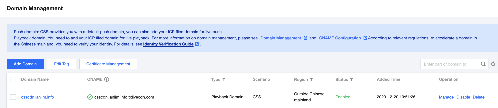
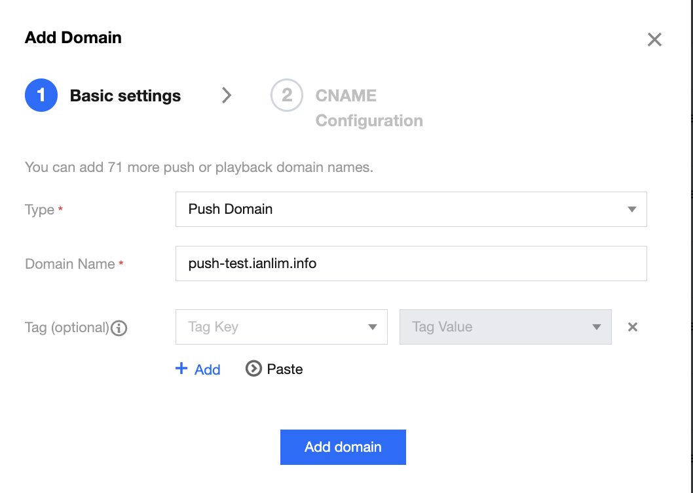
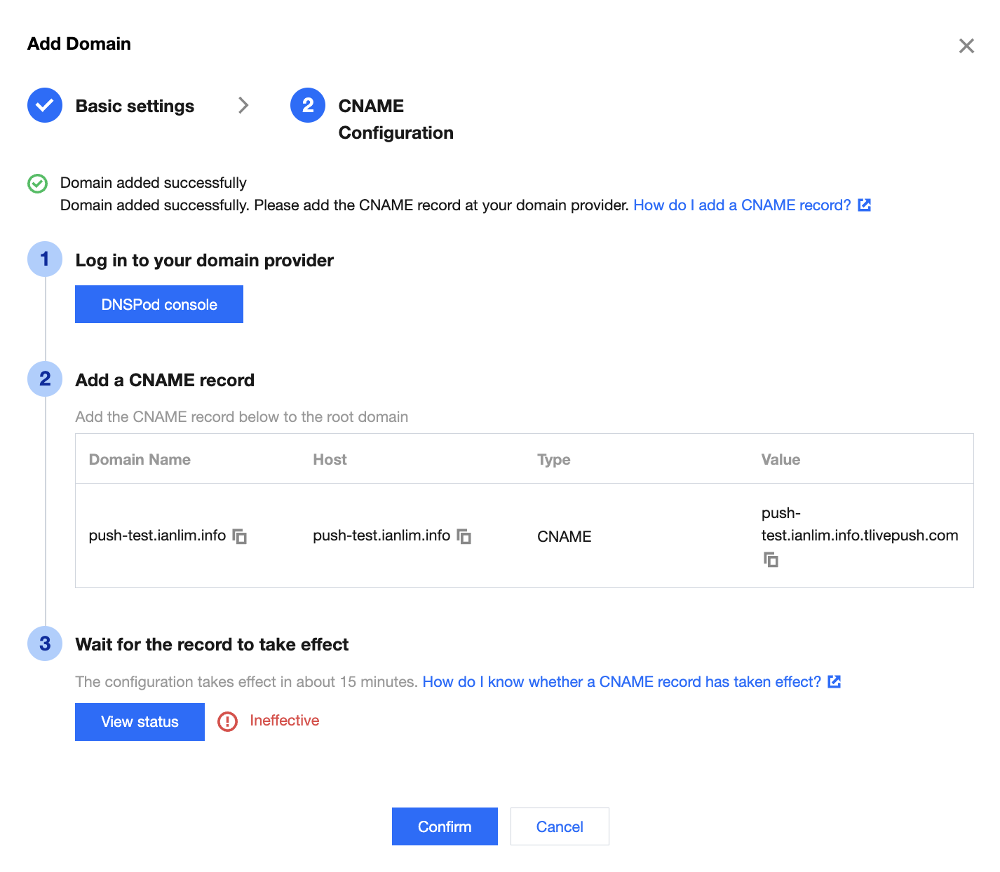
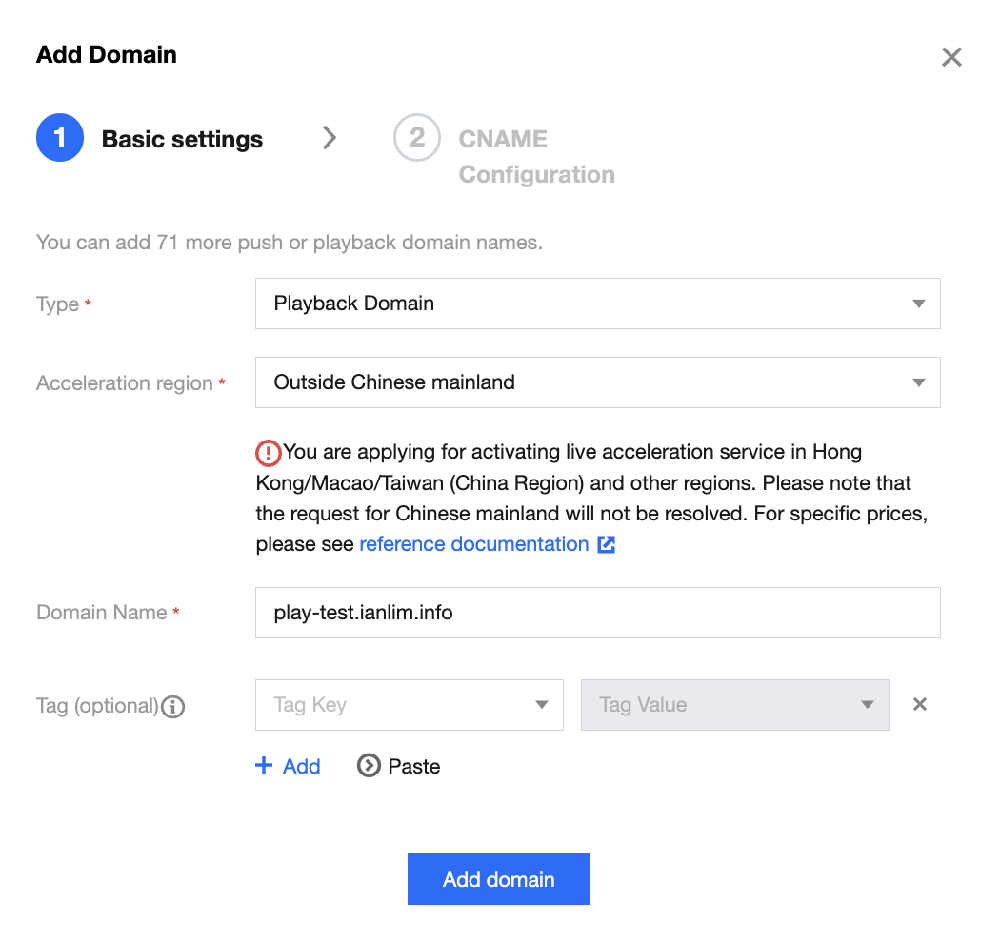
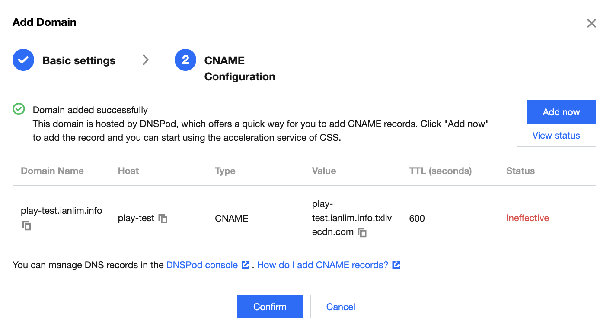
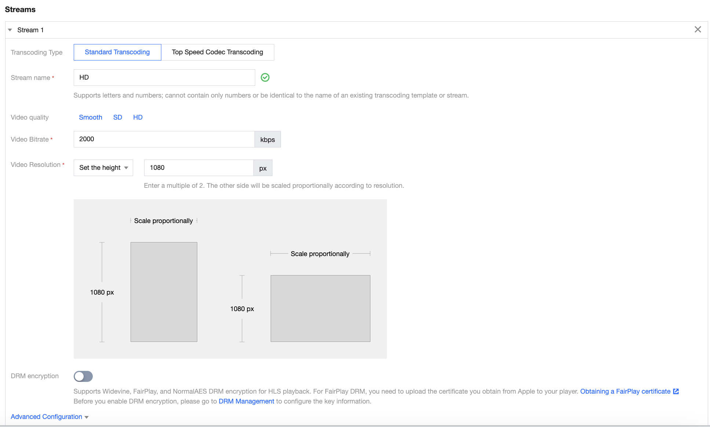
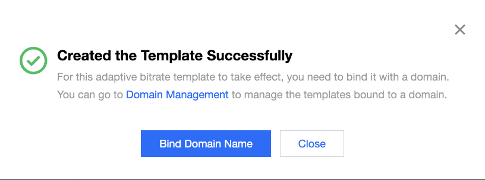
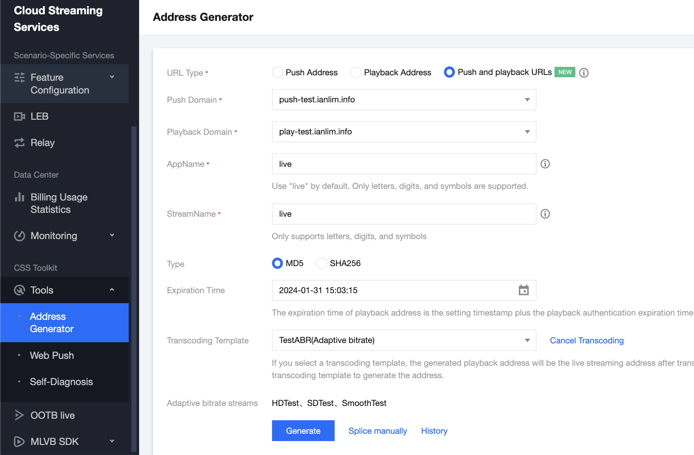
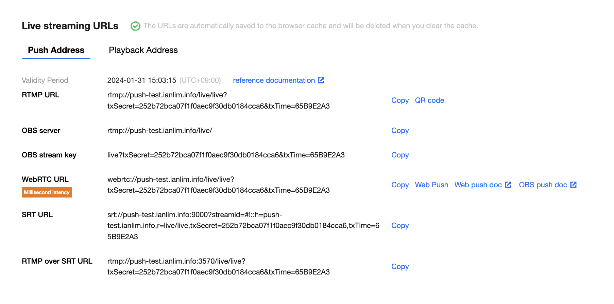

# workshop-css
Workshop for Tencent Cloud Cloud Streaming Service

CSS는 쉽고 간편하게 고품질 저지연의 라이브 스트리밍을 안정적으로 제공하기 위한 완전 관리형 서비스입니다. CSS는 라이브 채널을 빠르고 쉽게 생성하고 삭제할 수 있는 템플릿을 구성하여, 라이브 스트리밍 라이프사이클을 빠르고 손쉽게 구성할 수 있도록 도와줍니다.
템플릿을 사용하여 CSS 채널을 구성한 후 라이브 피드를 클라우드에 입수하면, 재생 URL을 얻을 수 있습니다. 즉, CSS가 트랜스코딩, 패키징을 관리하고 CSS CDN을 통해 시청자에게 스트리밍 비디오를 안정적으로 제공한다는 건데요.

이번 lab 에서는, Cloud Streaming Service 를 이용해 live feed 를 클라우드로 입수하고, 디바이스에서 플레이 할 수 있는 엔드 투 앤드 파이프라인을 구성하는 방법을 다룰 예정 입니다.

# 1. Pre-requisites
텐센트 클라우드의 Cloud Streaming Service 는 고객의 도메인을 통해 서비스 되는 형태 입니다. 즉, 텐센트 클라우드의 Cloud Streaming Service 를 이용하기 위해서는, Push 및 Play Domain 등록 과정에서 도메인 소유자라는 소유권을 알리고 등록하는 절차가 필요한데요. 한번 등록되면 상위 도메인이 동일한 도메인을 추가하는 경우 다시 확인할 필요가 없습니다. 

# 2. Create a push domain
1. CSS 콘솔 메인 화면 왼쪽 탭에서 *Domain* 탭을 클릭합니다. 그러면 현재 구성되어 있는 CSS 도메인들을 확인할 수 있습니다.
2. 메인 메뉴 위쪽에 위치한 *Add Domain* 버튼을 클릭 합니다.

3. 도메인 추가 팝업이 뜨면, 아래와 같이 Push Domain을 위한 값을 입력해 줍니다. 입력이 완료되면 *Add Domain* 버튼을 클릭해서 다음으로 이동합니다.
Type : Push domain
Domain Name : push 용으로 사용할 도메인 이름

4. CNAME Configuration 메뉴를 참고해서, DNS 서비스에서 host 에 대한 CNAME 값을 추가해 줍니다.
*CNAME Configuration 메뉴*

*DNS 에 CNAME 레코드 추가*

*CNAME 레코드 검증*

# 3. Create a play domain

1. CSS 콘솔 메인 화면 왼쪽 탭에서 *Domain* 탭을 클릭합니다. 그러면 현재 구성되어 있는 CSS 도메인들을 확인할 수 있습니다.

2. 메인 메뉴 위쪽에 위치한 *Add Domain* 버튼을 클릭 합니다.

3. 도메인 추가 팝업이 뜨면, 아래와 같이 Type 을 Playback Domain 으로 변경하고, 아래와 같은 값을 입력해 줍니다. 입력이 완료되면 *Add Domain* 버튼을 클릭해서 다음으로 이동합니다.
Type : Play domain
Acceleralation region : Outside Chinese mainland 
Domain Name : playback 용으로 사용할 도메인 이름

4. CNAME Configuration 메뉴를 참고해서, DNS 서비스에서 host 에 대한 CNAME 값을 추가해 줍니다.
**CNAME Configuration 메뉴**

**DNS 에 CNAME 레코드 추가**

**CNAME 레코드 검증**

# 4. Create a Adaptive Bitrate Domain

Tencent Cloud 의 Cloud Streaming Service 를 이용하면, 트랜스코딩 타입 해상도, 비트레이트를 별도 지정한 Adaptive Bitrate 구성을 템플릿으로 구성하고 Cloud Streaming Service 의 HLS Stream 및 WebRTC Streaming 에서 사용이 가능합니다.

> **NOTE** : Tencent Cloud 의 Cloud Streaming Service 에서 HLS, WebRTC Streaming 외 HTTP-FLV, RTMP 스트리밍을 통한 단일 비트레이트 포맷을 사용하는 경우, Adaptive Bitrate 가 아닌 Live Transcoding 기능 구성을 통해 스트림의 상세 스펙을 구성을 지원합니다.

1. CSS 콘솔 메인 화면 왼쪽 탭에서 *Feature Configuration -> Adaptive Bitrate* 탭을 클릭합니다.
2. Adaptive Bitrate 콘솔 상단에 *Create Template* 을 버튼을 클릭 합니다.
3. CSS 에서는 Template 을 구성해서 Bitrate, 해상도 등을 구성하고 ABR 래더를 생성할 수 있습니다.

    3-1. Template Name 은 *testABR* 을 입력합니다. 이는 임의의 값을 입력 가능 합니다.

    3-2. *Streams* 메뉴에는 ABR 래더를 구성하고 레더별 트랜스코딩 방법, 해상도, 비트레이트 등을 결정 할 수 있습니다.
이번 랩에서는 Standard Transcoding 을 활용한 기본 구성으로 진행할 예정 입니다.
다음과 같이 3개의 Stream 을 Adaptive Bitrate 으로 구성하고,
각각의 Stream Name 은 HD, SD, Smooth 로 구성합니다.
Stream Quality 은 각각 HD, SD, Smooth 을 선택합니다. 그러면 자동으로 resolution, bitrate 값들이 지정됩니다.
Note: 이번 랩에서는 기본값을 선택하지만, bitrate, resolution, transcoding type 등 유연하게 지정 가능합니다.

    3-3. Stream 구성까지 완료한 이후 *Save* 버튼을 클릭 합니다. 그러면 구성한 Adaptive Bitrate 템플릿을 Domain 과 Binding 하라는 팝업이 뜨는데요. 아래와 같이, 3번에서 구성한 Playback Domain 을 선택합니다.

# 5. Test and verify 

자, 이제까지 Push, Playback Domain 을 구성하고, Adaptive Bitrate 을 구성 및 Playback Domain 에 바인딩 했습니다.
실제 테스트를 해볼텐데요.

1. CSS 콘솔 좌측 메뉴에서 **Tools > Address Generator** 를 클릭합니다.
2. **Address Generator** 메뉴로 들어가면, 다음과 같이 값들을 입력해 줍니다. 그리고 **Generate** 버튼을 클릭합니다.

* URL Type : Push and playback URLs
* Stream Name : live
* ranscoding Template : testABR
    
3. Push address 를 확인합니다.

* Push address 로는 RTMP, WebRTC, SRT, RTMP over SRT 를 지원하고, OBS 입력 값은 별도로 출력되는 것을 확인할 수 있습니다.
* 이번 시간에는 OBS 를 통한 Push 를 실습해 볼 예정입니다.
* OBS 를 실행시켜서 Settings 버튼을 클릭하고,

* **Stream** 메뉴 내에 있는 값을 다음과 같이 입력합니다. 여기서 OBS server 및 OBS Stream key 정보는, 위 3번의 OBS server, stream key 값을 복사해서 붙여 넣은 후 저장 (OK) 버튼을 클릭해서 구성을 저장합니다.

* 그리고 **Start Streaming** 버튼을 클릭하면, 카메라의 피드가 OBS 를 통해 CSS Push URL 로 입수되게 됩니다.

> NOTE : OBS 다운로드 및 CSS 를 위한 환경 세팅 정보는 [여기](https://www.tencentcloud.com/document/product/267/31569?lang=en) 를 통해 확인할 수 있습니다.

4. Playback address 를 확인하고 HLS URL 을 copy 합니다.

5. [Tencent video player demo](https://tcplayer.vcube.tencent.com/intl/index.html) 사이트를 방문해서 **Playback URL** 에 붙여넣기 합니다. 그리고 **Preview** 버튼을 클릭 한 후, 정상적으로 HLS Stream 이 재생 되는지 확인 합니다.

6. 4번의 Playback address 에서 WebRTC URL 을 copy 합니다. [Tencent video player demo](https://tcplayer.vcube.tencent.com/intl/index.html) 사이트를 방문해서 **Playback URL** 에 붙여넣기 합니다. 그리고 **Preview** 버튼을 클릭 한 후, 정상적으로 WebRTC Stream 이 재생 되는지 확인 합니다.

> NOTE : CSS (Cloud Streaming Services) 의 Playback Domain 은 CDN 의 역할을 합니다. 만약 HTTPS 프로토콜을 이용해 안전한 연결을 하기 위해서는, (a)  CSS Playback domain 에서 [HTTPS 를 enable](https://www.tencentcloud.com/document/product/267/31066?lang=en) 하고 (b) [인증서를 발급받아 CSS 에 업로드](https://www.tencentcloud.com/document/product/267/41317?lang=en) 해야 합니다. 자세한 내용은 링크들을 클릭해서 확인해 주세요.
