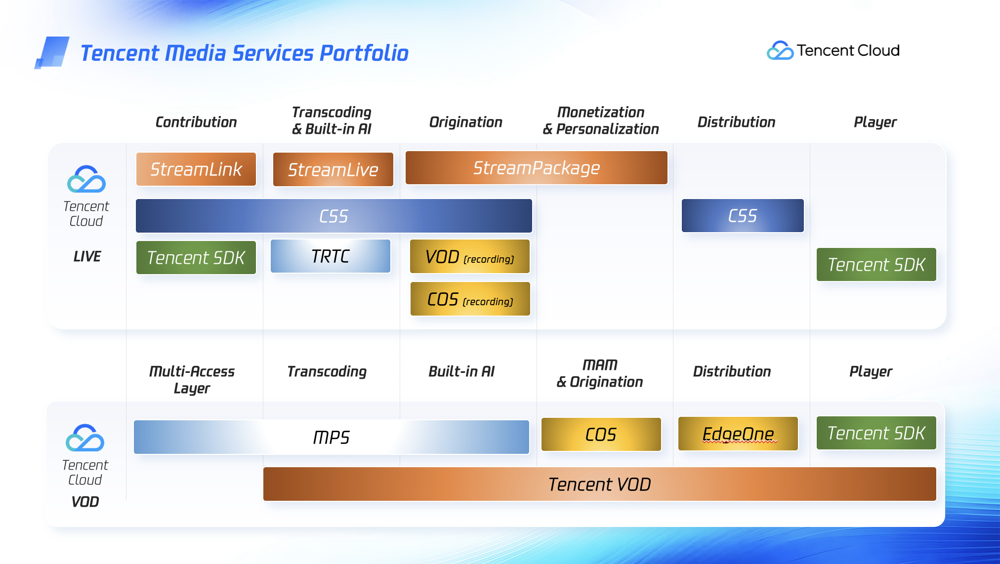
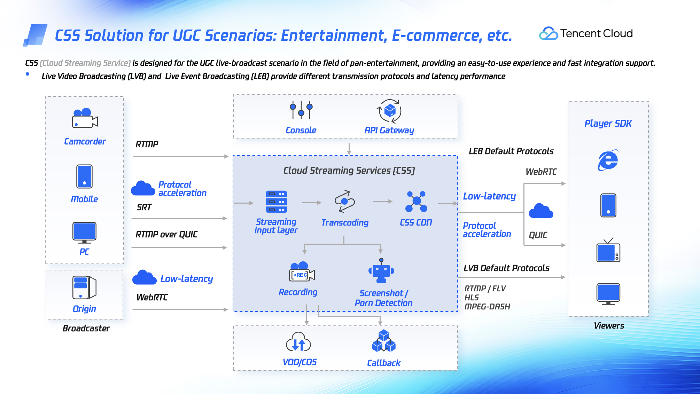
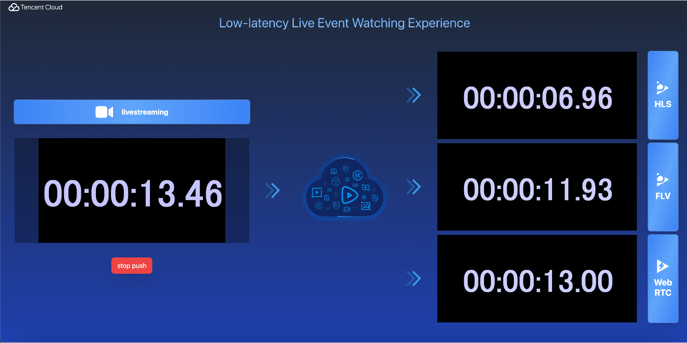

# workshop-css
Workshop for Tencent Cloud Cloud Streaming Service

# Tencent Cloud Media Services

텐센트 클라우드에서 제공하는 Media Services portfolio 를 한눈에 정리해 본 슬라이드인데요.여기서 말씀 드리는 서비스들은 모두 관리형 PaaS 서비스로, 고객께서 별도의 인프라에 대한 유지관리에 대한 걱정 없이 사용할 수 있도록 도움을 드리는 서비스 들 입니다. 
라이브 : 라이브 스트리밍에서의 워크플로우를 크게 보면, 라이브 피드를 입수하는 Contribution, 비디오/오디오를 인코딩하고 프로세싱하는 Transcoding, 스케일러블하게 스트리밍할 수 있도록 CDN 과 통합해 줄 수 있도록 하는 Origination, 부가가치로 비디오 내에 광고 를 동적으로 넣어서 수익화를 돕는 Monetization,  CDN을 통한 대규모 스트리밍하는 Distribution, 실제 엔드 유저가 재생하는 Playback 이 있는데요. 각 컴포넌트 별로, 텐센트 클라우드에서는 이를 도울수 있는 서비스 들이 있고 다음 슬라이드에서 각 서비스 에 대해 말씀 드리도록 하겠습니다.
VOD : VOD 프로세싱에서도 저희는 크게, 트랜스코딩과 AI 에 특화해서 빌딩 블록으로 각 고객에 맞추어 커스터마이즈 할 수 있는 MPS, 그리고 고객께서 콘텐츠에 대해서 더욱 집중할 수 있도록 미디어 입수 이후, 트랜스코딩, Built in AI, 미디어 자산관리 뿐만 아니라, CDN 까지 통합된 원스탑 솔루션인 Tencent VOD 서비스를 제공하고 있습니다.

# Tencent Cloud CSS (Cloud Streaming Services)

CSS는 쉽고 간편하게 고품질 저지연의 라이브 스트리밍을 안정적으로 제공하기 위한 완전 관리형 서비스입니다. CSS는 라이브 채널을 빠르고 쉽게 생성하고 삭제할 수 있는 템플릿을 구성하여, 라이브 스트리밍 라이프사이클을 빠르고 손쉽게 구성할 수 있도록 도와줍니다.
템플릿을 사용하여 CSS 채널을 구성한 후 라이브 피드를 클라우드에 입수하면, 재생 URL을 얻을 수 있습니다. 즉, CSS가 트랜스코딩, 패키징을 관리하고 CSS CDN을 통해 시청자에게 스트리밍 비디오를 안정적으로 제공한다는 건데요.
또한, 녹화, 썸네일, 모더레이션 등 리치한 기능을 기본적으로 빌트인 되서 지원하므로 별도의 AI 서비스등 추가 리소스 빌딩 블록을 사용하고 유지 관리할 필요가 없습니다.

그리고 CSS는 간단하고 low latency 서비스입니다. 따라서 기본적으로 RTMP, HLS 및 DASH 스트리밍 지원과 WebRTC 기반 스트리밍도 대규모로 sub-second latency 로 지원됩니다.

